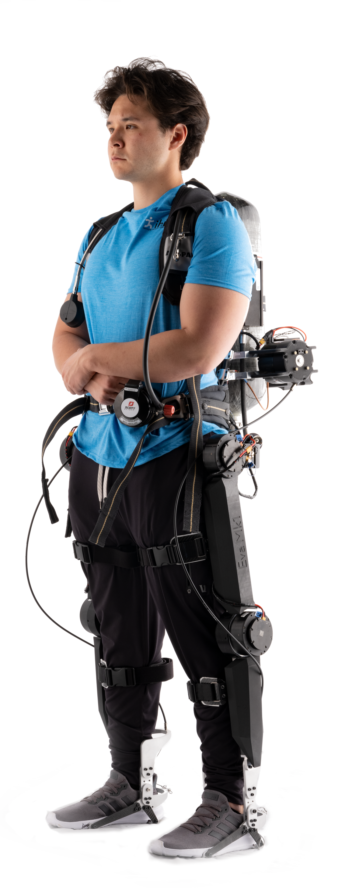
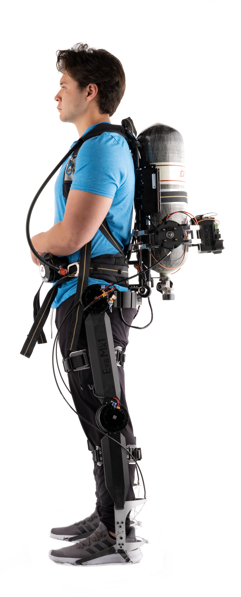
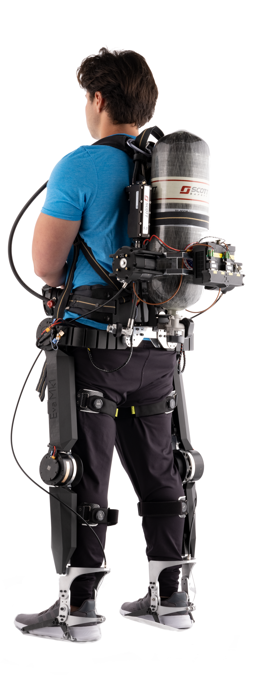
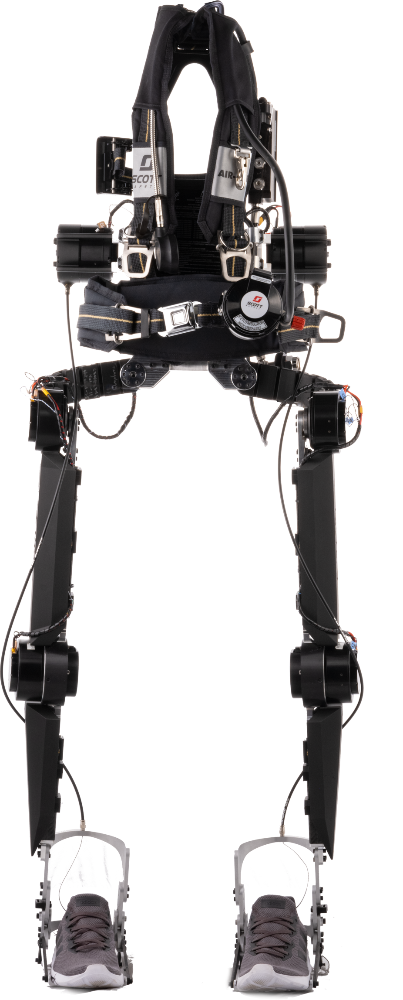
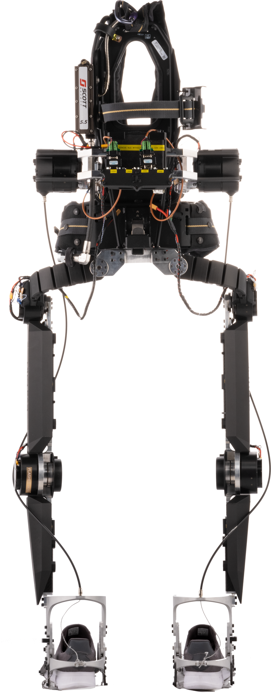
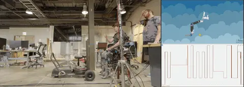

# Eva Mk.1 Augmentative Exoskeleton

## Introduction
Workers empoyed by the U.S. Department of Energy, who are tasked with the safe decommissioning of tank farm sites and disposal of nuclear waste without contaminating the surrounding environment, are exposed to significant radiological hazards, as well as heavy manual labor, a varied taskset, and extreme temperatures. Personal protective equipment (PPE) is required to shield workers from radiation, covering the full body and providing breathing protection usting respirator masks and fully self-contained breathing apparatuses (SCBAs) depending on the hazard levels of the work environment. However, SCBAs are often cumbersome and while providing excellent protection against contaminated particulates, they can be detrimental to the wearer’s biomechanics during dynamic and unstructured movement. Working with this added mass increases fatigue, leading to an increased risk for acute and chronic injuries.

As a result, there is a strong desire to increase worker safety across these sites. One field that is increasingly being explored for this purpose is robotics, however these robots are usually designed for singular purposes, limited by their ability to traverse uneven terrain, and/or lack the decision making capabilities to complete a full tank farm workday. While robots can currently serve as useful tools, humans still need to be in the loop to complete the vast majority of work.

To counter this dilemma, the technology can instead be applied to directly target worker safety in the form of wearable robots, or exoskeletons. Common industrial exoskeletons are passive, utilizing unpowered mechanisms to assist specific repetitive movements (e.g. floor-to-waist lifting, overhead manipulation tasks, working while leaning). Passive devices These are usually effective at assisting singular tasks, but have litte utuility in unstructured work environments that consist of numerous diverse tasks, and the magnitude of provided assistance is restricted to the mechanical properties of the passive elements. Furthermore, in situations that necessitate SCBAs, common exoskeletons cannot structurally offload the added weight from the wearer. A device capable of such diversity requires actively actuated joint-based assistance the user can have direct control over, as well as 

## The Device

  
  
  

In collaboration with Sandia National Labs (SNL), the IHMC exoskeleton group developed the powered hip-knee-ankle exoskeleton, Eva, with the purpose of offloading PPE and assisting tasks common to tank farm work. The first prototype, or Eva Mk.1, featured sagittal actuated degrees of freedom of the legs (i.e. hip and knee flexion/extension, ankle plantarflexion), as well as a suite of onboard sensors for state estimation and control (i.e. IMUs on each linkage, encoders at each joint, pressure sensitive insoles). The device was directly built around a commercial off-the-shelf SCBA harness, and featured height adjustability in the form of modular carbon fiber linkages.

Eva Mk.1 served as a testbed for task-agnostic gravity compensation control designed to offload the weight of the exoskeleton and SCBA from the user regardless of posture. This device also tested task-specific controllers designed to assist specific movements common to tank farm work (e.g. pushing/pulling, squatting/lifting, and walking), and a machine-learning (ML) based task classification system to recognize and transition between these controllers. Mk.1 provided opportunities for testing numerous body interfacing methods and biological joint collocation strategies to analyze the qualitative aspects of device comfort and user confidence. Much of this work has been presented at various robotics and Department of Energy conferences throughout recent years.

  
  

These developments were important steps on the path toward realizing a site-fieldable load carriage exoskeleton prototype and led to important design improvements to increase the technology readiness level (TRL) of Eva. Improvements in the development of the next generation Eva Mk2 exoskeleton, some initial demonstrations of new capabilities, as well as future work to further increase site applicability can be found [here]().

Supplementary material regarding the performance and collected data with the Eva Mk.1 exoskeleton can be found in [Li et. al](LiIROS2023.pdf) and [Winship et. al](WinshipICRA2024.pdf)

## Contributions

In collaborating with a team of engineers on the Eva Mk.1 Project, I was able to provide technical assistance on both the hardware front and controls debugging. Additionally, I served as a pilot for the devive, testing reinforcement learning policies for a range of tasks, including but not limited to walking, squatting, stair ascent and descent, and pushing and pulling heavy objects across various time intervals and repetitions. The Mk.1 version of the Eva exoskeleton served as a crucial learning opportunity for improved comprehension of qualitative variables (i.e. comfort, flexibility, interfacing, etc.) which play an important factor to the longevity and utility the user retains from the device while powered.

  

