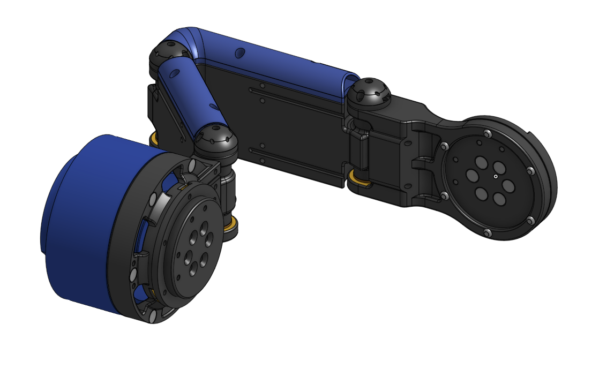
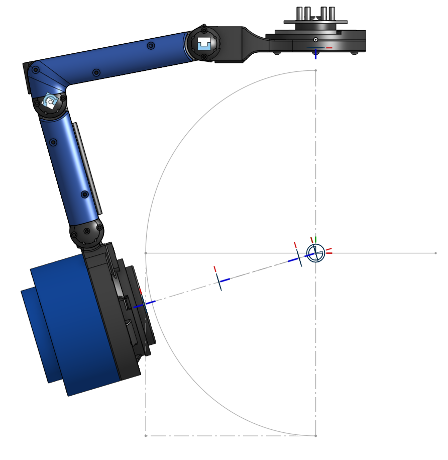
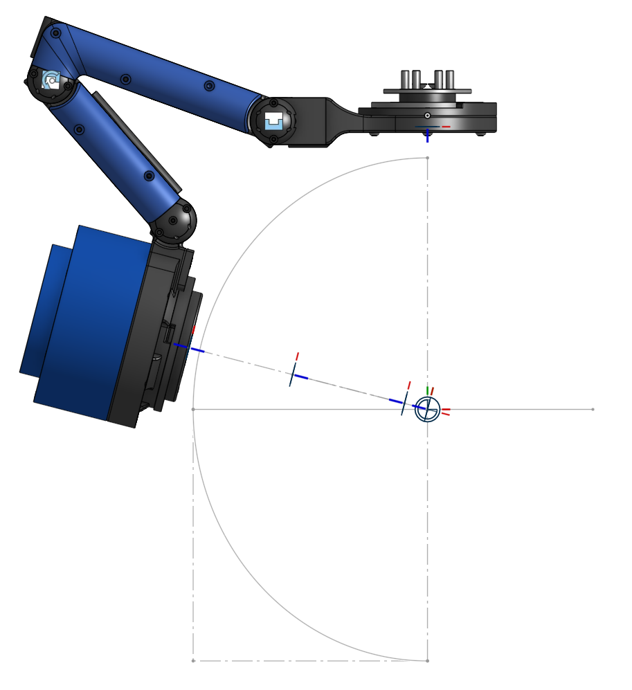
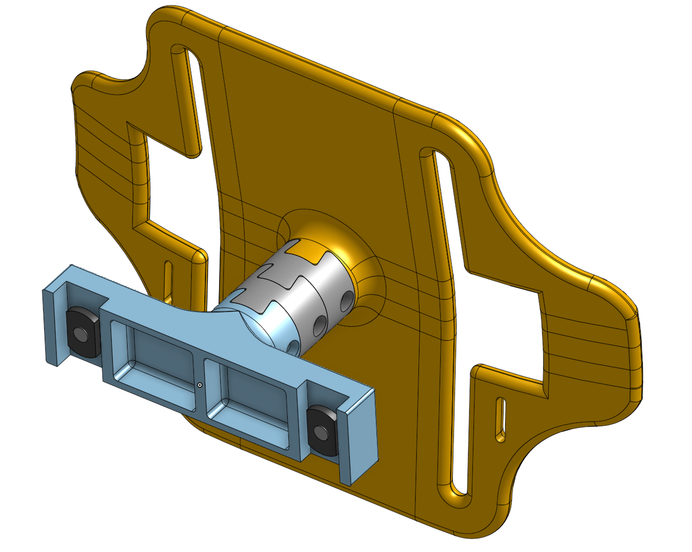
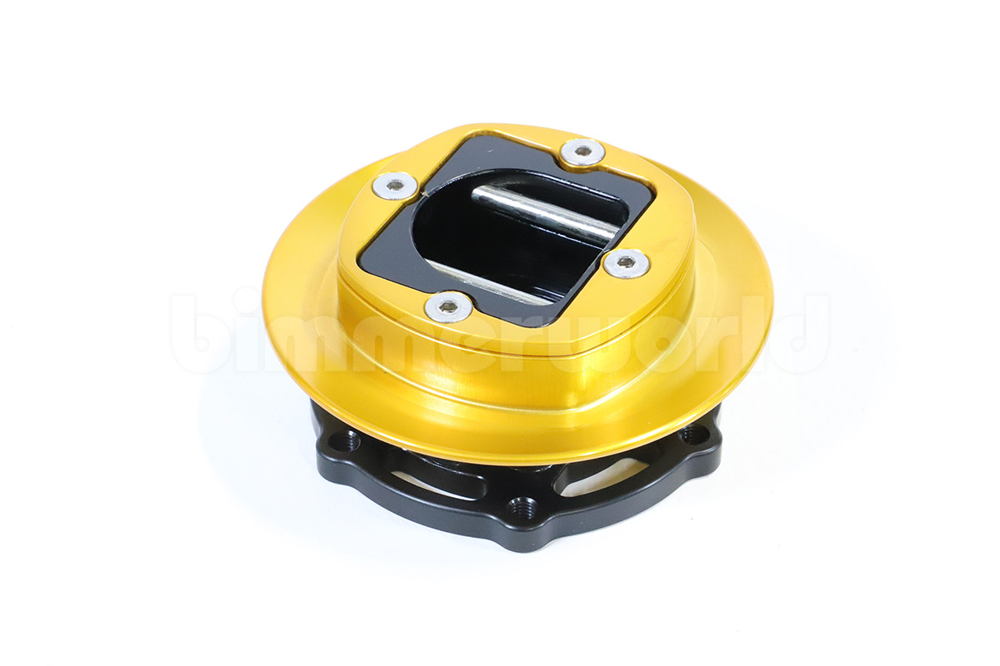
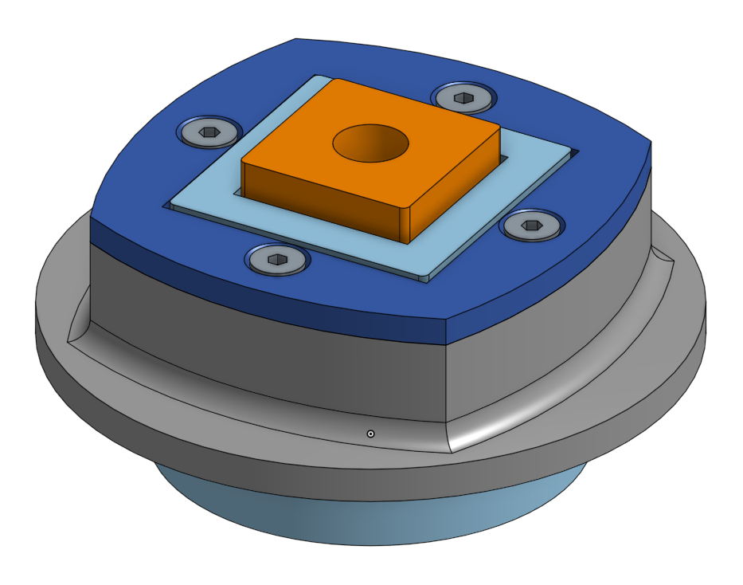
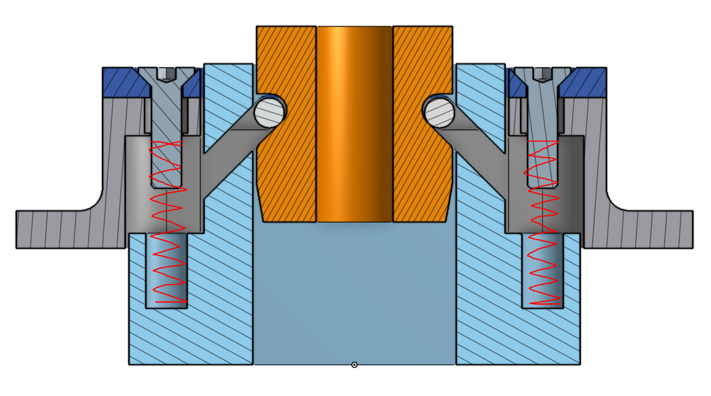
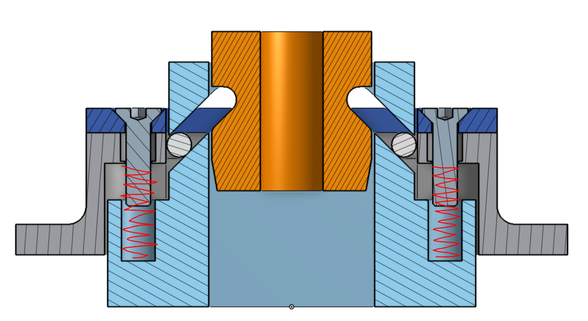
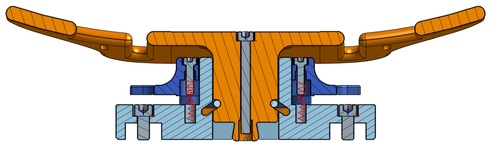
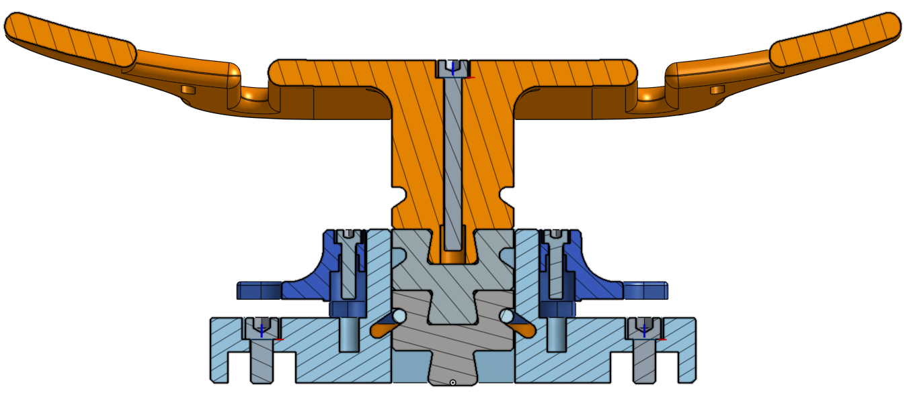

# Eva Mk.2 Augmentative Exoskeleton

## Introduction
The Eva Mk. 2 exoskeleton shares the same goal as the previous Mk1 version: to assist workers and offload PPE from workers at tank farms throughout their daily jobs. However, Mk. 2 was based on key design requirements to increase the possibility of taking the system out of the lab and into the real world. This included increased mechanical robustness and load carriage capability, increased interface comfort and adjustablility to many body types, battery operation for at least 60 minutes (the length of the 60-minute SCBA tank), and be completely operable by the user alone.

## The Device

  

Similar to Eva Mk. 1, the Mk. 2 device features numerous powered and passive degrees of freedom (DoFs) with mechanical hardstops to prevent motion outside of biological limits and adjustable structure to accomodate a wide range of user sizes. Actuation is present at the hips, knees, ankles sagittally, and hip ab/adduction is added in the frontal plane as a powered DoF. Previously on Mk1, the hip ab/adduction joints were passive, which resulted in a structural discontinuity between the backpack and the rest of the exoskeleton, limiting the device’s ability to offload weight. This added actuation allows the exoskeleton to be structurally “rigid” during torque application, and also increases the ability to support the user during ambulation and other dynamic movements. The hips also feature passive internal/external rotation using a multi-linkage mechanism, allowing for pivoting movements and adjusting to natural leg positions while ambulating. All powered DoF utilize AK10-9v2.0 actuators (CubeMars, Nanchang, Jiangxi, China) collocated with the user’s joints, minus the ankle remotely located in the backpack. Historically, these actuators were outsourced for their relatively cheaper cost while providing the necessary torque and speed specifications for controls policies, however they lack specific axial and moment loading specifications across the output. Rather that having linkages directly loaded to the gearbox, an additional thrust and radial bearing are added in series. 

  

## Contributions
The Mk. 2 device began development as part of the next phase of research alongside SNL after learning the shortcomings from the previous Mk.1 device. As a co-designer for the hardware, I put forth the designs for the passive, load-bearing hip joints that accomodated the users' hip internal/external rotation, unlike the fixed hip linkages that supported the Mk.1 device and became a source of discomfort for users. Additionally, I was responsible for the integration of soft goods and human interfacing in the upper body portion of the device for improved joint torque application without restricting natural human range of motion.  

### The Hips
The anatomical hip joint involves a ball-socket joint allowing for flexion/extension, abduction/adduction, and internal/external rotation of the leg. The abductions/adduction and flexion/extension motions are actively assisted through colocated robotic actuators and dedicated absoluted encoders, however the internal/external rotation motion was left passive to encourage freedom of motion, where the positions could still be measured as any given joint position. The passive mechanism also needed to maintain a level of rigidity in order to establish a defined load path for weight offloading to the ground from the users back. In order to connect the abduction/adduction joints to the external leg frame of the device, the mechanism is forced map around the users waistline and the inclusion of a prismatic joint could be considered. However, accurately measuring linear positon across a linearly prismatic joint undergoing joint loading from lower limb reaction forces and moments, all in a cost effective manner, posed a particular challenge. Commercial linear encoders possess strict read height tolerances with narrow margins for error, and implementing high-stiffness linear elements to command greater control of these height tolerances drastically drives up the price, regardless of using off-the-shelf or custom solutions. 

To combat this dilemma, instead of a prismatic joint, the use of revolute joints capable of folding in and out of itself could accomplish a similar behavior. This investigation brought into question what the optimal number of revolute joints in series would be required to offer the necessary range of motion for average internal/external rotation without introducing significant kinematic or sensing complexity. Too many joints would complicate how the device would predict the necessary assistance to apply across the active hip joints, as well as introduce potential singularity behaviors that would be hazardous to the user without elements to hold a neutral position.

  

Full external and internal rotation of the hips (Link1 and Link2 at their maximum ROM while maintaining conformity to hip IC). Resulting in 14 degrees external rotation and 16 degrees internal rotation. I/E motions past these regions result in the Flex/Ex distal link no longer conforming to the user and drift outward. These ranges of motion will also vary between user hip dimensions.

  
  

### Torso Interfacing
A different design approach was taken for the torso interface. The existing version using modular dovetail adjustment blocks provides a sturdy and simplistic approach, however the ease of making size adjustments is hindered by the little hand room present, especially on the shortest setting. 

  

The new approach to the design needed to accomplish the same range of size increments of the original design and confined within the same space behind the torso place, all the while providing a more user friendly and faster method of alternating between settings. To accomplish this, spring-loaded locking mechanisms with quick release latching were investigated. The settled approach was the pin locking attachment used for steering wheels, designed for handling axial and torque loading. 

  

The method of locking into place involves two dowel pins which are forced inward by springs into the central column to keep it secured.

  

  
  

Pushing the central block into the cavity is enough force to retract the dowel pins until they quick lock back into place. The initial prototype was optimized to resist pulling forces, however it lacked any bottom support surface in order to stop the block from being pushed in further and falling through the system. The second iteration was meant to take the initial concept and integrate it with the torso plate and adjustable T tracks on the backpack.

  

The second iteration requires less axial travel of the spring loaded cage in order to disengage the pins given the reduced amount of work room, however the mechanism was expanded radially to encompass a larger central block to engage with. Both sides of the cage are given winglets to press down with your fingers in order to unlock the mechanism, either of which can be used independently without having to reach around the opposite side. The central cavity was kept hollow, however central block would receive the bottom support surface from the backpack plate itself, maximizing the depth needed for modularity. The spring mechanism remains fixed the back pack, but could be used to interface across multiple groove settings on the central block. The modular dovetail block chain approach was kept, with additional locking grooves to interface with the pins. All block dimensions were designed to retain the same base distance and size increments as the original modular design.

  

The original dovetail approach also uses M4 bolts that lock each block connection together. The spring attachment does not use these bolts, as there is no room for the blocks to come apart from one another while in the central cavity. However, the removal of the bolts and the addition of the pin notches has resulted in reduced stiffness in the blocks, where the joints are much more elastic when the joints are experiencing axial pulling or remote moment loading. Reintroducing the bolts would solve the issue, but defeat the purpose of the fast interchangeability of sizing blocks. Machining the blocks will increase the mass of the mechanism and the cost.
