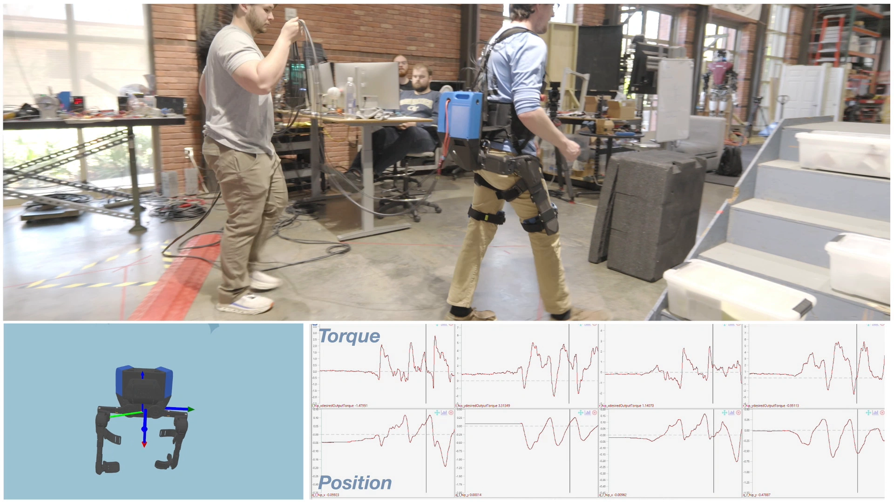
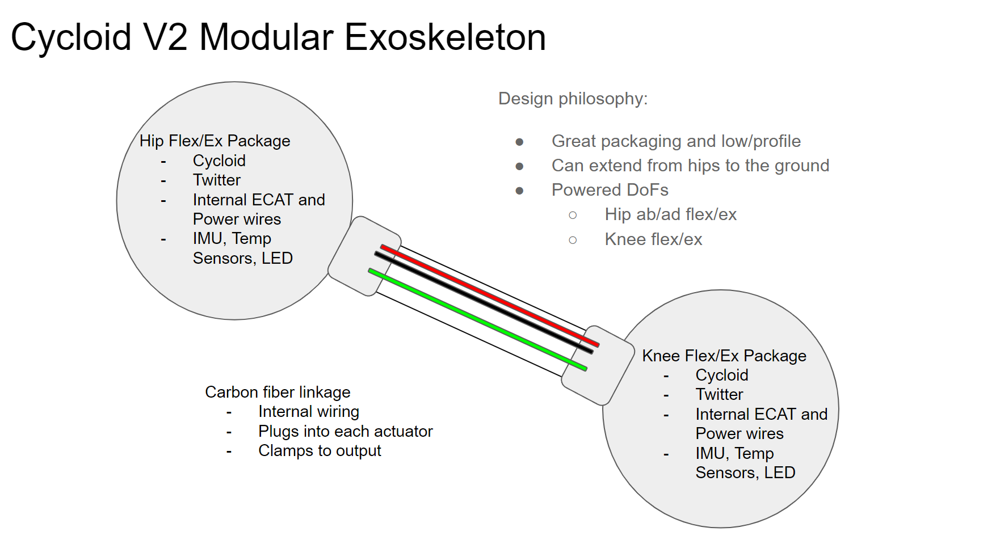

# Link Augmentative Exoskeleton

## Introduction
The Eva Mk.2 exoskeleton was a great device with high potential for on-site deployment assisting with labor intensive tasks. However, further human piloting and experimentations, the following conclusions became apparent: Mk.2 lacked in usage for non-load carriage tasks, the SCBA harness systems are not as widespread in hazardous environments as they once were, and there little confidence in the adoption of the technology that the likelihood of site-use approval was low. At the time, there was not a catch-all exoskeleton device designed to assist users over wide ranges of tasks, and developing such a device requires extensive time, resources, funding, and experimental validation. Instead, the focus was shifted such the structure should easily morph to the requirements of the customer and use case that warrants physical assistance.

## The Device

  

Link is an assistive device system that can be configured for a wide range of purposes to address this problem. Because there is no “catch-all” exoskeleton device, the approach was changed to where the hardware is configured based on the task. At its core, Link is a high-power 2 DoF hip exoskeleton with add-ons including:

- knee flexion/extension
- ankle plantarflexion (exploring both passive and active options)
- upper body joints driven by lighweight cable-based systems

  

Different controls policies are applied for each sensed configuration and based on a wide ranging dataset of biomechanical measures from common manual materials handling motions and ambulation styles. This is also paired with a transparency mode that will allow the user to move freely in the device with or without extra assistance.

Electrically, the system is controlled by an NVIDIA Jetson computer and functions off of custom LiPo batteries, capable of powering the suit at it’s full configuration (upper body and lower body) for approximately one hour. The user will have access to an onboard operational user interface (OUI) style controller, and control various aspects of device operation, including but not limited to toggling active assistance, modulating and metering assistance magnitudes, and monitoring device status. The manual settings of the device (lengths of the bars, etc.) will be handled automatically without altering parameters on the computer.

  

## Contributions
The Link exoskeleton provided the opportunity to deploy an assistive device using the custom brushless cycloidal actuators optimized for this particular application detailed in my graduate thesis. Synonymously with the V2 actuation development and modifications, additional effort was required to package it with a dedicated motor controller and in-series electrical harnessing as part of a singular embedded packaged system, capable of easy swapping/replacement to minimize servicing downtime. These actuation packages were linked together using a locking mechanism with modular thigh structures and integrated electronics to reduce visible external wiring. Muliple revisions were applied to the passive hip chain structure introduced in the Mk. 2 exoskeleton and optimized for Link.

### The Actuators
The V2 brushless cycloid actuators are the next iteration in part of the design progression of the V1 prototype, explained in greater detail [here](https://github.com/seanray2k/Project-Portfolio/blob/main/Prototypes/Actuators/Custom%20Actuators/Cycloidal%20Actuator%20Research/17%3A1%20Cycloidal%20Actuator%20for%20Exoskeletal%20Research.md).

### The Hips

The linkage based design for the hip chain developed for the Eva Mk.2 device was readapted for the Link device. The mechanical behaviors were observed and various issues were acknowledged and needed revisiting. The hard stop on the second linkage engages firstly in the chain during external rotation, and motion is compensated for by the first linkage and the flexion/extension linkage. The first linkage hard stop engages 4 degrees after the second, accounting for the full true external range of rotation. Additionally, the hard stop range of the second linkage could not be expanded to be the same as the first (such that they would engage at the same time) due to the existing hard stop preventing the second linkage from reaching a singularity point and potentially collapse the hips inward towards the user. 

Expanding the link dimensions would counter the singularity issue, however this would negatively impact users in the lower percentile range, whos lower hip depth from the gluteal region already forces the first linkage to its external hard stop and limits overall range of motion. Vice versa would apply for larger users if the profiles shrank. A potential avenue would be to explore maintaining the current positions of the passive joints in the chain, but alter the profile geometry between the joints in order to change the vectors of internal forces during loading. This could be another method for adjusting where the singularity points between joints occur.

With power applied to the system and gravity compensation active, the torques generated by both the abduction/adduction and flexion/extension DoFs (same direction) put the hip links in a constant state of torsion. When the user flexes their leg upward and performs floating internal/external motion, the torque application from both hip actuators are acting in opposing directions. During floating external rotation, the opposing torques create a “collapsing” behavior, where the links in the chain quickly settle into their full rotation positions. This behavior has been observed during floating internal/external rotation, and not during standard vertical internal/external motion. This could be addressed by having tracking across the hip links and tuning the applied torques across abduction/adduction, however this does introduce a pinch point and cause the user injury.

### The Legs

  

