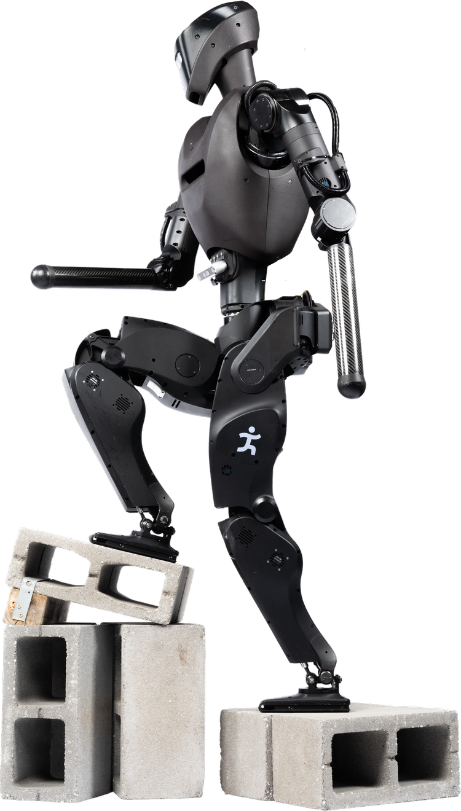

# Alex Electric Humanoid Robot

## Introduction
Alex is a next generation humanoid robot platform that builds off the success of Nadia, featuring high power, custom actuators, as well as completely onboard computation, perception, and power. Alex focuses on mobility, power, and autonomous and semi-autonomous behaviors, allowing it to function both outside and in urban environments and structures. The development of Alex is funded through several sources, including the Office of Naval Research (ONR), Army Research Laboratory (ARL), and Army Data Analysis Center (DAC). More information and research publications regarding the design and control strategies for Alex can be found on the [IHMC Robotics website](https://robots.ihmc.us/humanoid-design).

  
  

More dynamic performances can be found [here](https://www.youtube.com/watch?v=d7zNFP0OfGE).

## Press Releases
- [xTechHumanoid Winners Advance Military Exploration of Emerging Humanoid Capabilities](https://www.dvidshub.net/news/575814/xtechhumanoid-winners-advance-military-exploration-emerging-humanoid-capabilities)

## Contributions
My in depth knowledge of cycloidal actuator design, maintenance, and integration made me an asset throughout the assembly, analysis, low-level controls bringup, and servicing the modular cycloidal actuator framework and its surounding structure. My involvement on the Alex project provided extensive hands-on experience with evaluating both quantitative and qualitative inferences for servicing the actuator packages, as well as informing other design methodologies for cycloidal transmissions to achieve low friction performance. This experience provided me the opportunity to take on the responsibility to co-lead the optimization efforts for a newer arm design, taking inspiration from the modular design philosohpy and visual aesthetic from the rest of the humanoid and deliver a cohesive robotic platform. The complex design and iterative approach when modifying components of the robot introduced the chance to evaluate the top-down internal organization strategies and versioning history used throughout the development process. As a result, I learned the importance of higher level organization strategies crucial to the documentation and upkeep efforts outside of engineering design, highlighed in greater detail in the [Design Guidelines](https://github.com/seanray2k/Project-Portfolio/blob/main/Design%20Guidelines%20and%20Practices/Design%20Guidelines.md) section. Following the optimization efforts of the arms, anthropamorphic robotic hands and grippers used during both teleoperated and automated piloting for manipulation were the next challenge to solve, where I began to work on design solutions that were suited for the rigorous task assignments and testing that commercially available solutions often failed to perform.

### V2 Modular Arm Design
### Custom Gripper for Power Grasping Tasks

  

