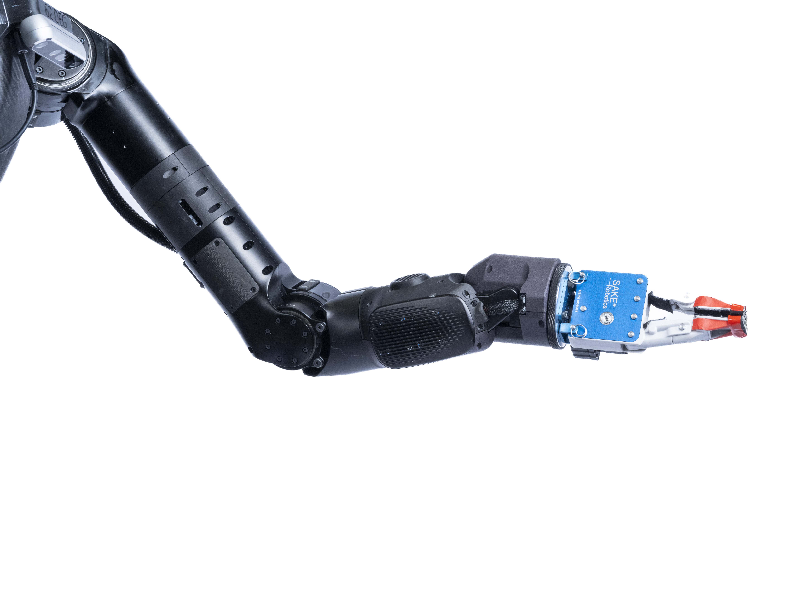
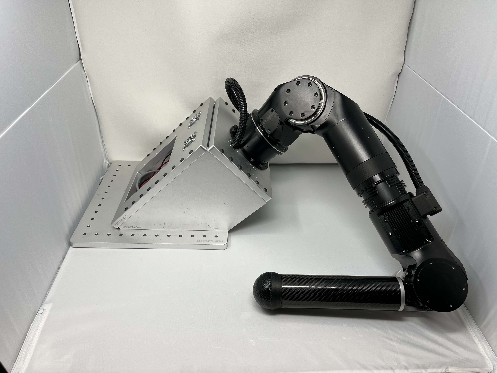

# Nadia Hydraulic Humanoid Robot

## Introduction
Nadia was a next generation humanoid robot platform along with collaborators Boardwalk Robotics, Morfey Ltd, and H4 Labs. Nadia was designed to have have a high power-to-weight ratio and large range of motion through the use of innovative mechanisms and composite materials. Nadia was also being used to develop autonomous and semi-autonomous behaviors to allow the robot to function in urban environments and structures. The robot’s namesake is famed gymnast Nadia Comăneci, as a nod to the ultimate design goal — achieving human-range-of-motion. The development of Nadia was funded through several sources, including the Office of Naval Research (ONR), Army Research Laboratory (ARL), NASA Johnson Space Center, and TARDEC. More information and research publications regarding the design and control strategies can be found on the [IHMC Robotics website](https://robots.ihmc.us/humanoid-design).

  

  
  

More dynamic performances using these cycloidal arms can be found [here](https://www.youtube.com/watch?v=uTmUfOc7r_s).

## Contributions
With the knowledge accrued from previous research, I was responsible for the assembly, analysis, low-level controls bringup, and servicing the cycloidal actuators and arm structures implemented on Nadia, and would later be carried over into the [Alex Humanoid](). My involvement on the Nadia project provided key insights on conducting both quantitative and qualitative inferences for servicing the actuator packages, as well as informing other design methodologies for cycloidal transmissions to achieve low friction performance.

  

  

