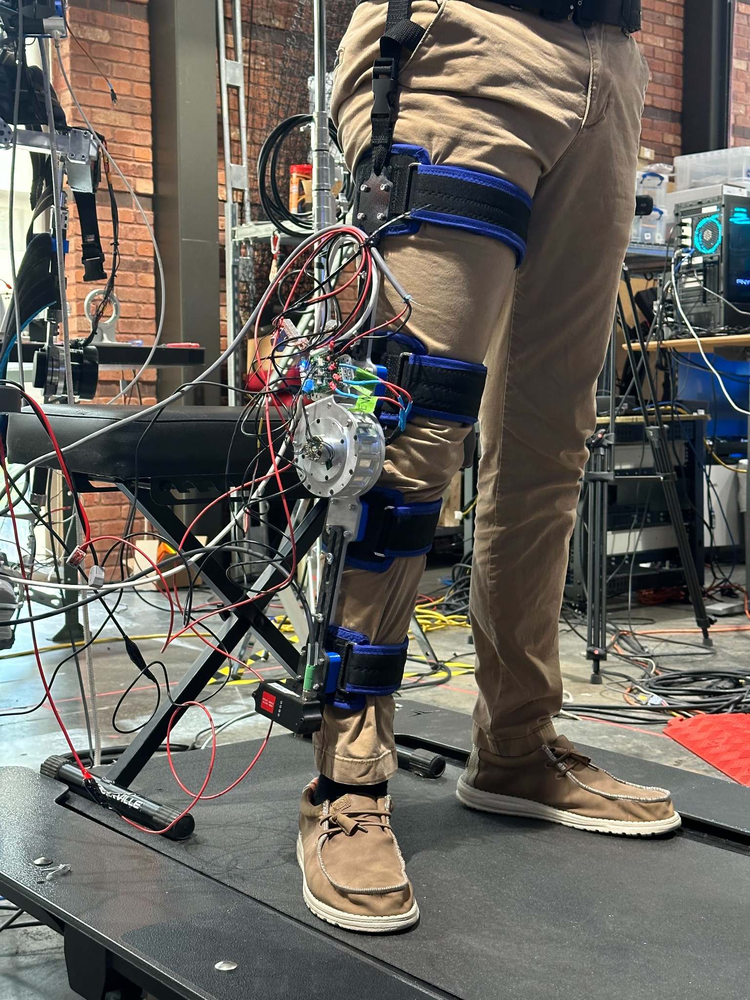
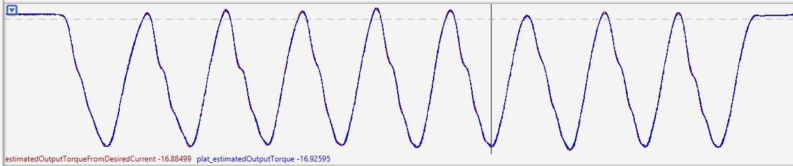
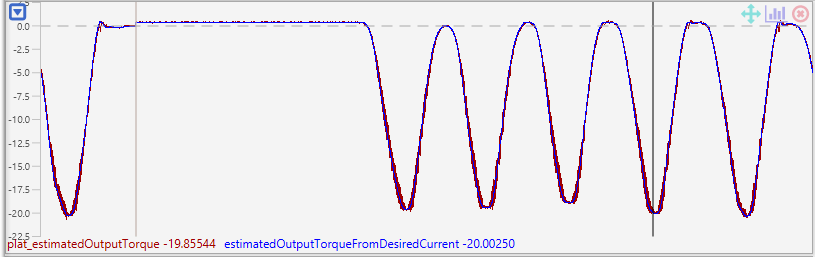

# 17:1 Cycloidal Actuator for Exoskeletal Research

## Introduction
The knowledge gained from the development timeline for this actuator can be found through the publication of my thesis in part of receiving my MS degree in robotics engineering found [here](https://www.proquest.com/docview/3054735987?fromopenview=true&pq-origsite=gscholar&sourcetype=Dissertations%20&%20Theses)

### Abstract
The performance of commercial robotic actuators are reported to be efficient and offer the
advantage of having a universal application-based design. However these advantages can fall short
when applied to assistive exoskeletons, where the efficiency is no longer repeatable, and the designs of
the actuating systems become a limiting factor in the capabilities and required performances of the
exoskeleton overall. Many robotic actuators have embedded planetary reductions, which can be easily
machined and mass produced. These planetary reductions can also become a source for backlash to
occur between meshed gear pairs, and with cyclic impact forces propagating throughout the exoskeleton
during standard operation, the backlash becomes continually worse due to material deformation and
the actuator no longer complies with the required standards. By contrast, cycloidal reductions offer
higher reduction ratios within the same height profile, and the curvatures of the gears themselves offer
greater distribution of stress concentrations under continuous and cyclic loading. With a minimal
backlash, low-friction design, and the same backdrivability as planetary reductions, actuation solutions
with an embedded cycloidal reduction are a viable avenue for assisted lower-limb exoskeleton research.

The purpose of this research was to develop a custom cycloidal actuator prototype, which
maximized the allowable output torques generated by the transmission while remaining within the
generalized lower-limb joint velocities during running gait, which is not guaranteed by outsourcing
commercial actuator units. The specifications of the motor input and the reduction ratio were tailored
for the actuators performance across all lower-limb joints during various performances tasks. The
targeted actuator output speed to serve as a universal actuation solution across lower-limb gait is task
dependent, with an inversely proportional relationship to the output torque and assistance potential.
After characterization, low-level controls strategies were derived, which operate simultaneously with
the commanded input signals to compensate for transmission losses that would affect feed-forward
accuracy.

Multiple experiments were conducted to identify and verify performance specifications, where
the results ultimately inform the usability of this prototype in future exoskeleton research. The
platform used for controlling and tuning the actuator input and output performance allow for greater
creative liberty with parameter optimization. By setting the stringent requirements for the performance
of the actuator, greater opportunities are generated for exercising various control strategies across
multiple human performance objectives. Such objectives extend past the standard self-selected walking
and running gaits, including but not limited to stair ascent and descent, jumping, and lunging.

  

## Validation Through Knee Exoskeleton Apparatus

Following the characterization and validation through test bench static and dynamic behaviors, the actuator prototype and motor controller were attached to a laser-cut aluminum knee apparatus and hand-sewn thigh and shank interfaces.

  
  

The device was subjected to an initial squating experiment with a virtual spring model about the knee DoF, supplying approximately 15 Nm assistive torque at N=2. The bandwidth of the system was tested by incrementally increasing the frequency which the participate would squat up and down until unable to keep up with the metronome, reaching up to 200 bpm. 

  

Leg extensions while sitting at 180 bpm and light jogging at 5 mph were also evaluated using the same virtual spring model. 

  
  

  

